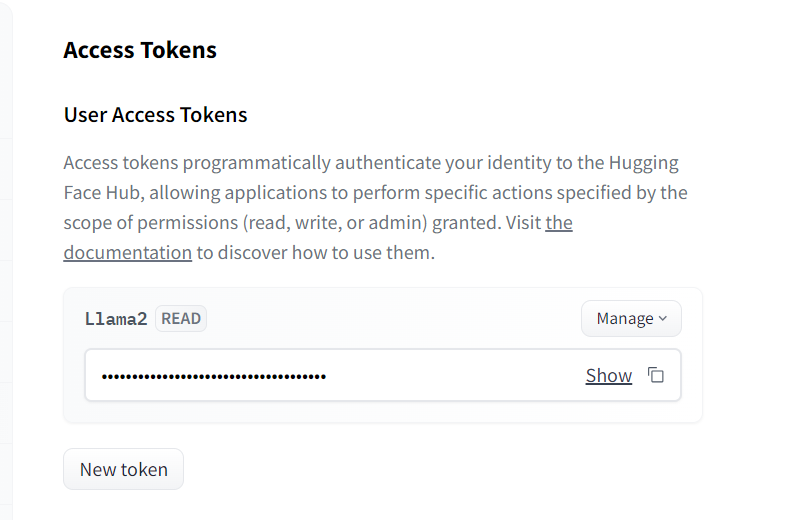

# MentalHealthBot

To use the MentalHealthBot, we'll need to follow some steps:
1. Fork and Clone this repo
2. [Donwload LLama2 Model Binaries](https://huggingface.co/TheBloke/Llama-2-7B-Chat-GGML/blob/main/llama-2-7b-chat.ggmlv3.q4_0.bin)
3. [Get your Token at HuggingFace](https://huggingface.co/settings/tokens) 
4. Create .env and put your access token on a "HUGGINGFACEHUB_API_TOKEN" variable.
5. Run on terminal "pip install -r requirements.txt"