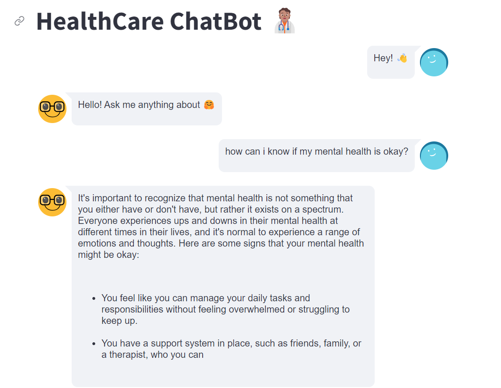
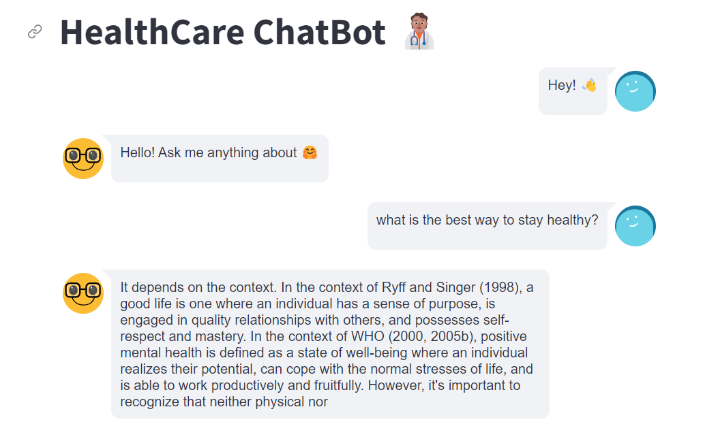
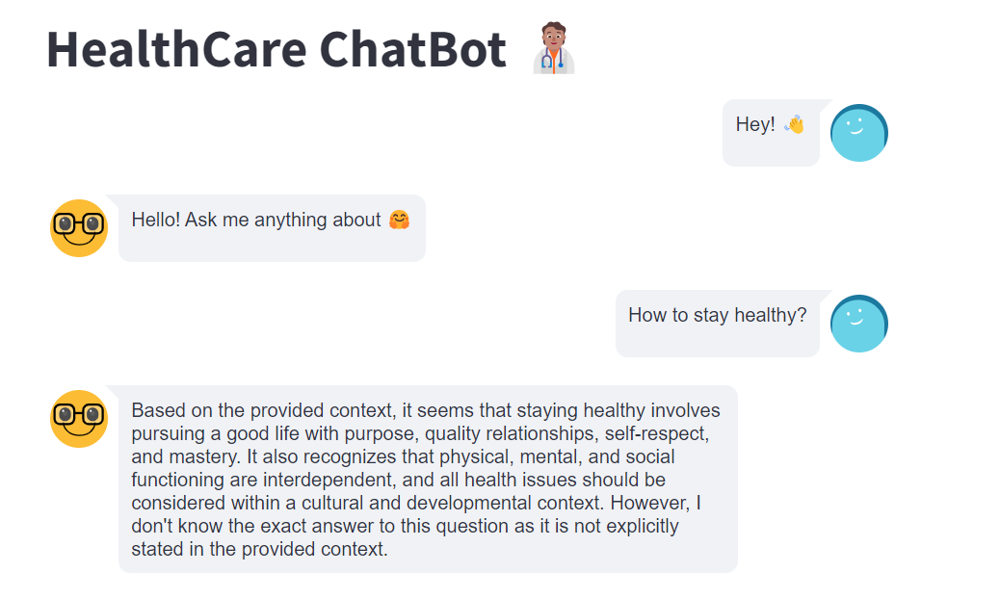

# MentalHealthBot

To use the MentalHealthBot, we'll need to follow some steps:
1. Fork and Clone this repo
2. [Donwload LLama2 Model Binaries](https://huggingface.co/TheBloke/Llama-2-7B-Chat-GGML/blob/main/llama-2-7b-chat.ggmlv3.q4_0.bin)
3. Run on terminal "pip install -r -u requirements.txt"
4. Run on terminal "streamlit run app.py"

- 
- 
- 